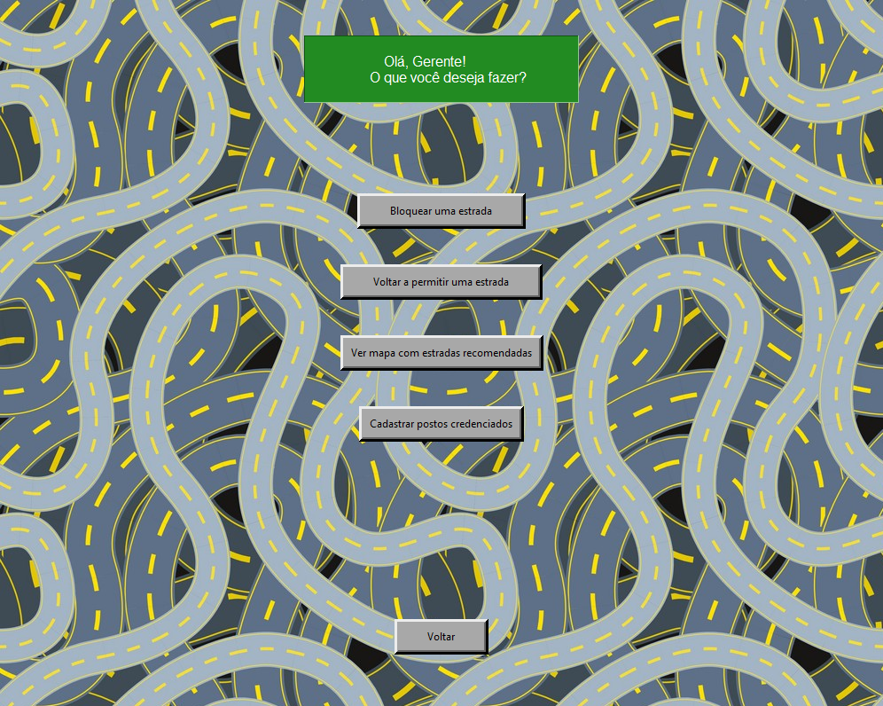
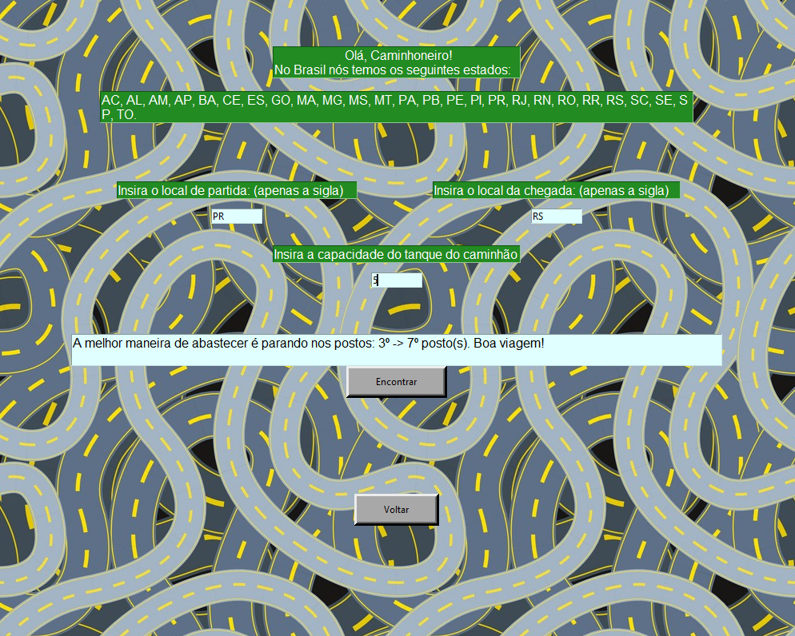

# Dupla 25 - Transportadora Fernandinho

**Número da Lista**: 25<br>
**Conteúdo da Disciplina**: Trabalho Final<br>

## Alunos
|Matrícula | Aluno |
| -- | -- |
| 18/0101617  |  Guilherme de Morais Richter |
| 18/0102613  |  Ítalo Fernandes Sales de Serra |

## Apresentação

Clique no link para assistir à apresentação: https://youtu.be/63J8bUeTE6s

## Sobre 
A ideia por trás deste projeto é aprimorar o projeto que fizemos nas entregas de Grafos 1 e 2, e tendo neste não somente funções de gerenciamento de estradas e geração de caminhos utilizando os conhecimentos adquiridos sobre **Grafos**, mas também adicionando funções de **Algoritmos ambiciosos**.

Com esse projeto temos o objetivo de auxiliar no gerenciamento de uma transportadora, auxiliar caminhoneiros a terem conhecimento sobre qual é o melhor caminhos entre os estados do Brasil por meio das estradas interestaduais e a melhor maneira de abastecer seus caminhões nos caminhos das entregas. O programa possui dois perfis:
- <b>Caminhoneiro</b>: Perfil em que o caminhoneiro pode solicitar a melhor rota que deseja, ver quais estradas estão em funcionamento e solicitar a melhor maneira de abastecer seu caminhão durante o trajeto.
- <b>Gerente de transporte</b>: Perfil em que um gerente da transportadora pode gerir os seus caminhoneiros do sentido de permitir ou não eles de pegarem certas estradas e também a cadastrar postos de combustível credenciados.

## Screenshots

<b>Screenshot do menu inicial.</b>


<b>Screenshot do menu do gerente da transportadora.</b>


<b>Screenshot de geração de melhor caminho.</b>


<b>Screenshot do menu do caminhoneiro.</b>


<b>Screenshot da escala de abastecimento.</b>


<b>Screenshot do cronograma de atividades.</b>


<b>Screenshot do mapa de trânsito.</b>


## Instalação 
**Linguagem**: Python<br>
**Framework**: Tkinter (biblioteca), NetworkX (biblioteca)<br>


Para criar um ambiente em que seja possível rodar o programa, é necessário:

- Instalar a versão <b>3.9.5</b> do Python.

- Instalar via terminal as seguintes bibliotecas

```python
pip install tk
```
```python
pip install PIL
```
```python
pip install networkx
```
```python
pip install matplotlib
```

- Clonar o nosso repositório do GitHub para a sua máquina, digitando no terminal (necessário ter o Git instalado):

```python
git clone https://github.com/projeto-de-algoritmos/Final_Dupla25.git
```

## Uso 

Para utilizar o nosso programa, é necessário que navegue no terminal até o diretório em que está clonado o nosso repositório, no caso, <b>Final_Dupla25</b>.

Com o repositório aberto, rodar o seguinte comando:

```python
python interface.py
```

## Outros 

Não há outras observações.
